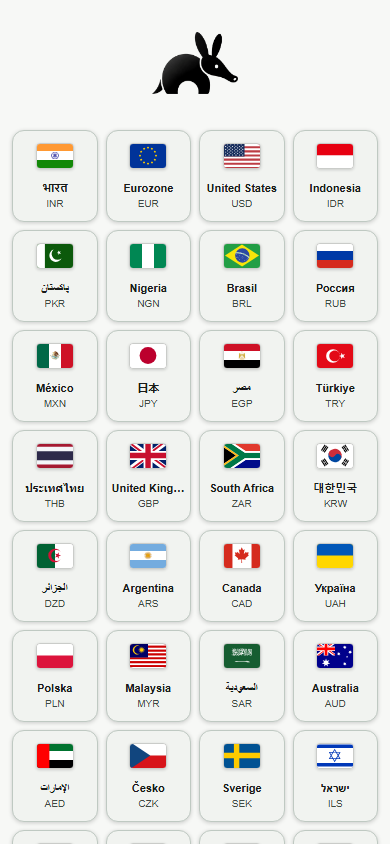
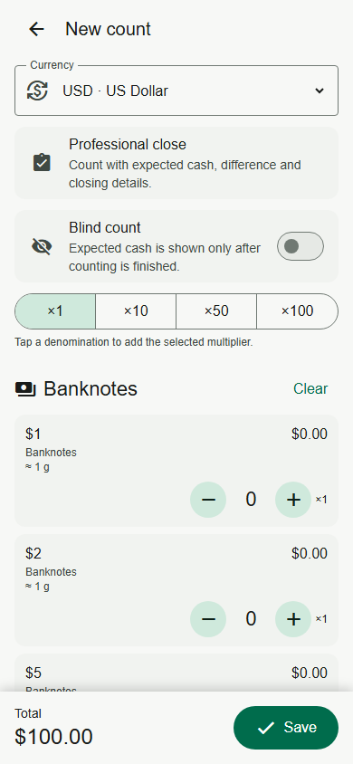
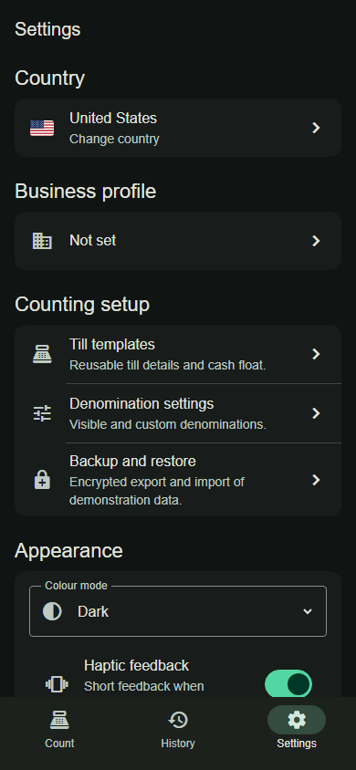
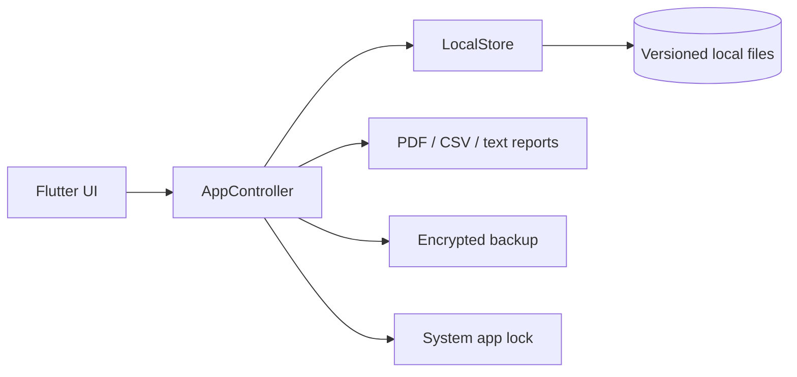

# Aardvarkland CashTally

Open-source offline cash counting and till-closing app for Android and iOS.

[Live Demo](https://maxmilianbaron.github.io/Aardvarkland-CashTally/) · [Screenshots](#screenshots) · [Quick Start](#quick-start) · [Documentation](docs/) · [Releases](https://github.com/MaxmilianBaron/Aardvarkland-CashTally/releases)

  

## Overview

CashTally is a Flutter application for denomination-based cash counting, professional till closing, POS reconciliation, and local reporting. It works offline, stores operational data on the device, and supports 32 currencies and 36 interface languages.

## Why this project?

- Replace error-prone calculator and spreadsheet workflows at till closing.
- Count by denomination with fast multipliers, blind counting, and expected-cash reconciliation.
- Preserve a local history with PDF, CSV, plain-text, and SHA-256 report fingerprints.
- Support cashier and manager signatures, till templates, and POS/EFTPOS CSV imports.
- Keep business data offline with encrypted backup and optional system app lock.

## Features

- Quick counts and professional till-closing workflows
- 32 currencies, 201 banknotes, 191 coins, and 36 interface languages
- Denomination multipliers, custom denominations, favorites, and till templates
- Expected cash, variance, deposit, retained cash, and POS reconciliation
- Local history with search and filters
- PDF reports, CSV exports, final-text sharing, signatures, and SHA-256 fingerprints
- AES-256-GCM encrypted backup with PBKDF2-HMAC-SHA256 key derivation
- Optional device PIN/password/biometric app lock
- Offline-first storage with explicit schema migrations
- No advertising, subscriptions, or in-app purchases in the default public configuration

## Screenshots

| Currency selection | Professional count | Settings and themes |
| --- | --- | --- |
|  |  |  |

## Live Demo

Try the [interactive browser preview](https://maxmilianbaron.github.io/Aardvarkland-CashTally/). It mirrors the main workflows with safe browser-only sample data. Native app lock, file sharing, printing, and platform storage are represented by browser equivalents in the demo.

## Quick Start

Requires Flutter 3.44+ with Dart 3.12+.

```bash
git clone https://github.com/MaxmilianBaron/Aardvarkland-CashTally.git
cd Aardvarkland-CashTally
flutter pub get
flutter run
```

## Installation

The repository includes Android and iOS platform wrappers. Install Flutter, accept the target platform SDK licenses, then select a connected device with `flutter devices` and run `flutter run`.

## Configuration

The default public build is fully functional without ads or purchases. Optional future monetization hooks require explicit build-time values and store configuration; see [`docs/MONETIZATION_SETUP.md`](docs/MONETIZATION_SETUP.md). Never commit signing files, credentials, store keys, or real cash-closing data.

## Development

```bash
flutter pub get
dart format --set-exit-if-changed .
flutter analyze
flutter test
```

Use `scripts/bootstrap.sh` only when intentionally regenerating platform wrappers; it can overwrite native project changes.

## Testing

```bash
python scripts/verify_source.py
python scripts/test_native_patcher.py
flutter analyze
flutter test
```

Automated tests cover money arithmetic in integer minor units, catalogs, localization, migrations, backups, reports, and core UI behavior. Store transactions, biometrics, file pickers, printing, and physical-device acceptance remain separate checks.

## Building

```bash
flutter build apk --debug
flutter build appbundle --release
flutter build ios --release --no-codesign
```

Android release signing and Apple provisioning must be configured outside the repository. A successful build is not evidence of store acceptance or physical-device behavior.

## Architecture



Money is stored as integer minor units. Reports and backups are generated locally; there is no required application server.

## Project Structure

- `lib/` — application UI, state, models, services, catalogs, and localization
- `test/` — unit, widget, migration, localization, and report tests
- `android/`, `ios/` — platform wrappers
- `scripts/` — source verification, localization, and native project tooling
- `docs/` — architecture, data, release, and configuration notes
- `preview/` — independent GitHub Pages browser demo

## Roadmap

- Expand accessibility and physical-device coverage
- Improve POS import mapping and report customization
- Complete independent accounting and legal review for more jurisdictions
- Publish reproducible store-release and signing documentation without secrets

## Contributing

See [CONTRIBUTING.md](CONTRIBUTING.md).

## Security

See [SECURITY.md](SECURITY.md). Never attach real till exports, signatures, or business records to a public issue.

## Related Projects

For warehouse inventory and logistics, see [Aardvarkland WMS](https://github.com/MaxmilianBaron/Aardvarkland-WMS) and [Aardvarkland WMS Mini](https://github.com/MaxmilianBaron/Aardvarkland-WMS-Mini).

## License

Licensed under the [MIT License](LICENSE).

If you find this project useful, consider giving it a star — it helps others discover the project.
